# Документация

## Содержание

1. [Введение](#введение)
2. [Конфигурация](#конфигурация)
3. [Эндпоинты](#эндпоинты)
4. [Безопасность](#безопасность)
5. [Api Documentation](#api-documentation)
6. [Пример работы](#пример-работы)
## Введение

Этот проект представляет собой Spring Boot приложение с настройками безопасности и различными эндпоинтами для
регистрации пользователей, аутентификации и доступа к данным.

## Конфигурация

Конфигурация безопасности определена в файле `src/main/java/org/example/registration/configuration/SecurityConfig.java`.
Она включает настройки для CSRF, CORS, управления сессиями и провайдеров аутентификации.

## Эндпоинты

Приложение предоставляет несколько эндпоинтов:

- `/login`: Аутентифицирует пользователя и возвращает JWT токен.
- `/registration`: Регистрирует нового пользователя.
- `/reset-password`: Сбрасывает пароль пользователя.
- `/unsecured`: Доступен без аутентификации.
- `/admin`: Доступен только пользователям с ролью `ADMIN`.
- `/info`: Возвращает информацию о аутентифицированном пользователе.

## Безопасность

Конфигурация безопасности использует JWT для аутентификации и включает пользовательские фильтры и
обработчики.

# Api Documentation

## Registration

- **Endpoint:** `/registration`
- **Method:** `POST`
- **Request Body:**

json
{
"username": "name",
"email" : "mail",
"password": "password",
"confirmPassword" : "password"
}

- **Response:**
  - **Success:** `20O OK`
  - **Failure:**
    - `400 Bad Request` if passwords do not match
    - `400 Bad Request` if name is already contains in db

## Authentication

- **Endpoint:** `/login`
- **Method:** `POST`
- **Request Body:**

{
"username": "name",
"password": "password",
"rememberMe" : true/false
}

- **Response:**
    - **Success:** `200 OK` with JWT token (30 days if `rememberMe` is true, otherwise 10 minutes)
    - **Failure:** `401 Unauthorized`

## Password Reset

- **Endpoint:** `/reset-password`
- **Method:** `POST`
- **Request Body:**

json
{
"name": "string",
"newPassword": "string",
"confirmPassword": "string",
"confirmationCode": "0000"
}

- **Response:**
  - **Success:** `200 OK`
  - **Failure:**
    - `400 Bad Request` if passwords do not match
    - `400 Bad Request` if the confirmation code is incorrect

# Пример работы

1. Регистрация пользователя

необходимо перейти по эндпоинту `/registration` и отправить POST запрос с данными пользователя

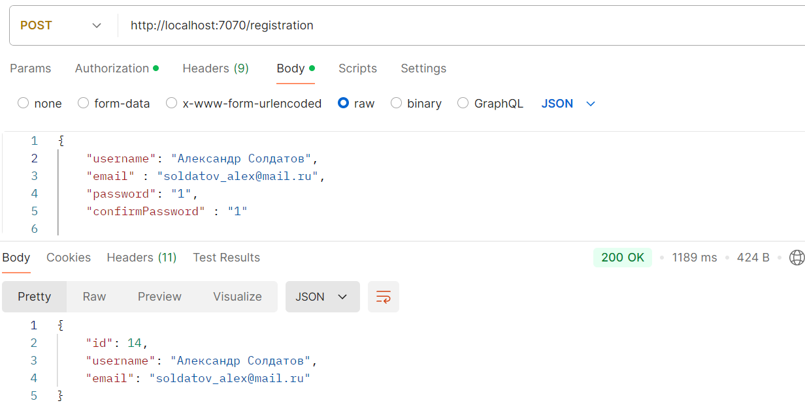

получаем Json {
"id": 14,
"username": "Александр Солдатов",
"email": "soldatov_alex@mail.ru"
} , который выдает id пользователя после чего мы понимаем , что регистрация была успешна и пользователь добавлен в базу данных

Если вы попытаетесь зарегистрировать пользователя с именем , которое уже есть в базе данных , то вы получите ошибку 400 Bad Request
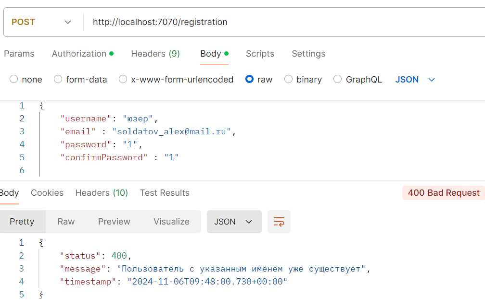

Если пароли не будут совпадать , то также вы получите ошибку 400 Bad Request
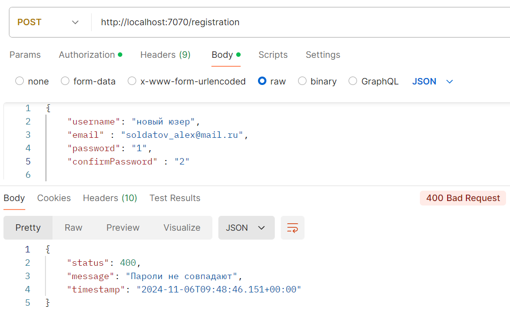

2. Аутентификация пользователя
необходимо перейти по эндпоинту `/login` и отправить POST запрос с данными пользователя
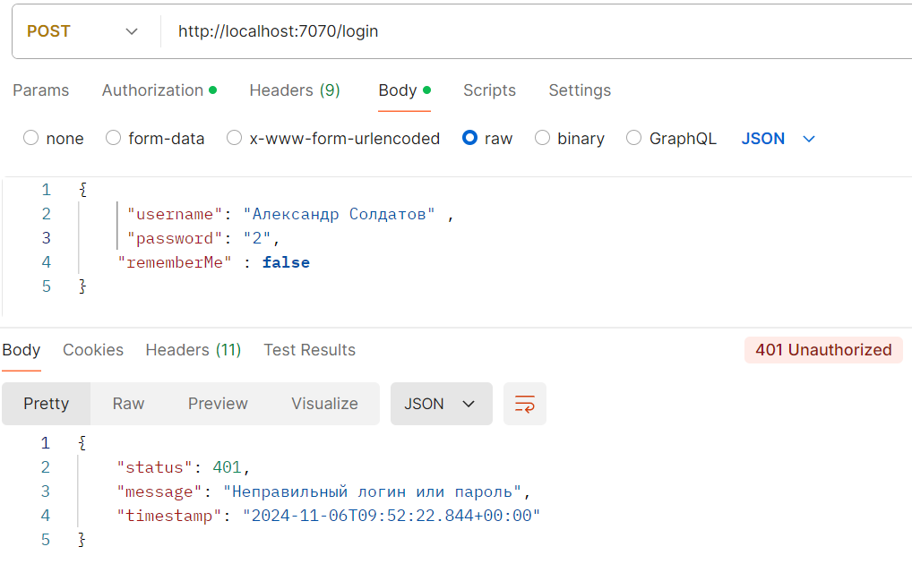
если данные пользователя верны , то вы получите ответ 200 OK и JWT токен, иначе 401 Unauthorized
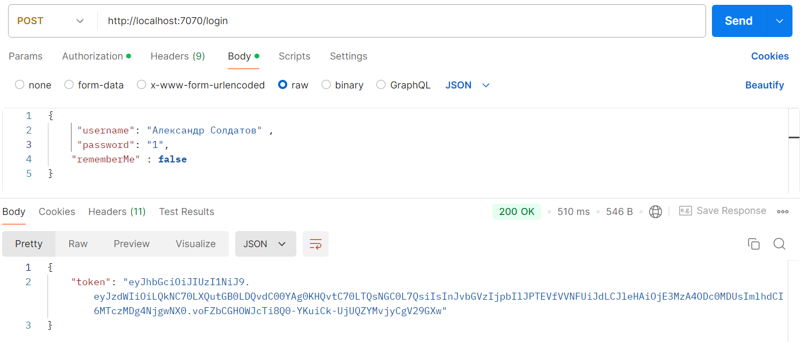
с полученным токеном можно получить доступ к другим эндпоинтам взавимости роли (по-дефолту роль USER)
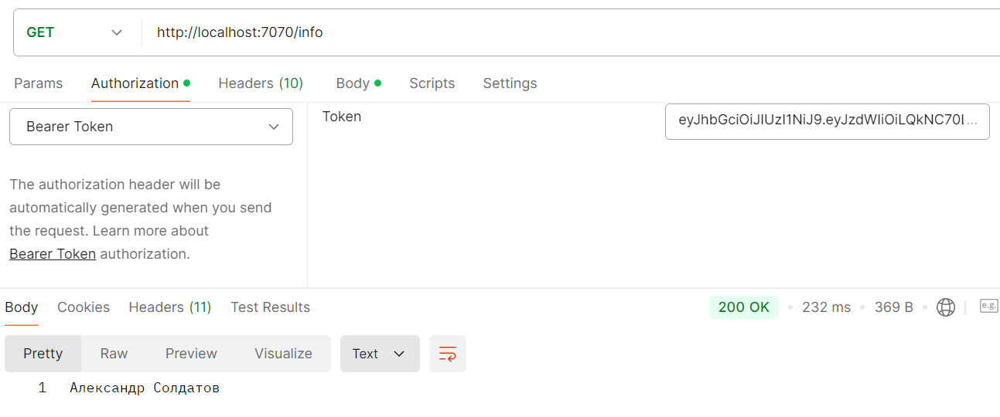
при попытке доступа к эндпоинту `/admin` вы получите ошибку 403 Forbidden
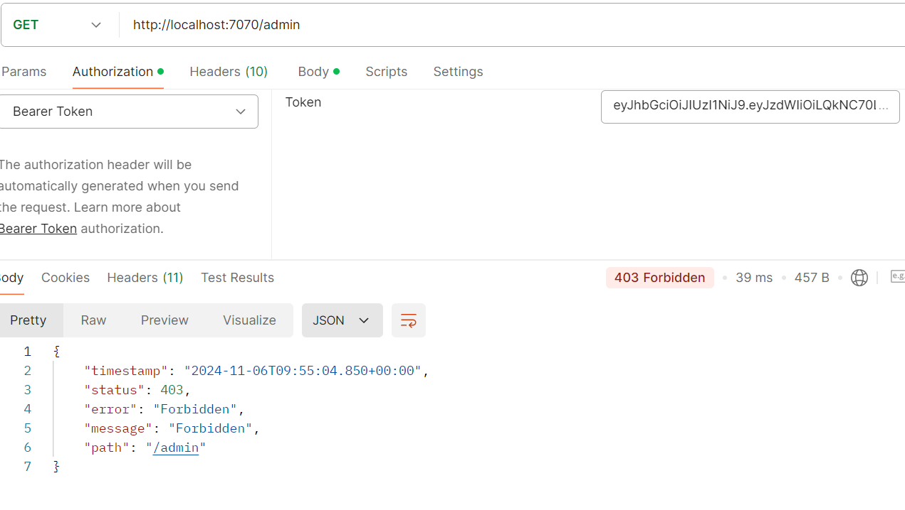
проверка получения эндпоинта `/admin` с токеном c ролью ADMIN
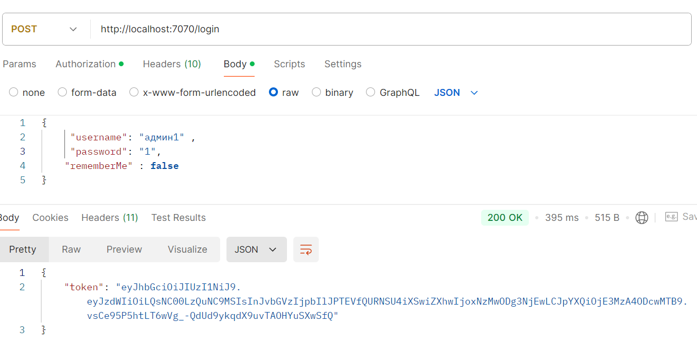
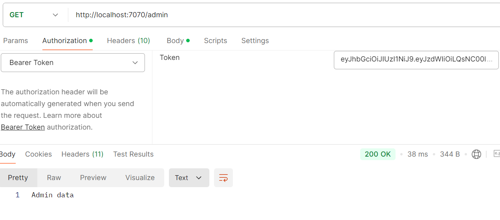
3. Сброс пароля
необходимо перейти по эндпоинту `/reset-password` и отправить POST запрос с данными пользователя
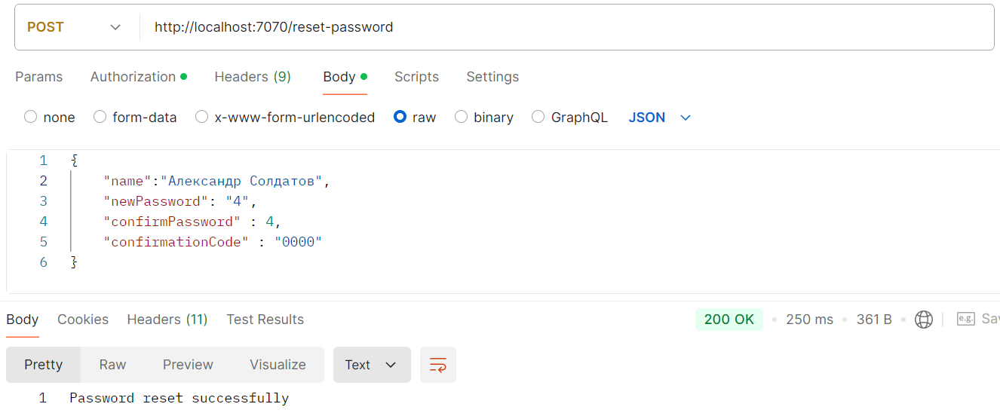
проверка логина со старым паролем
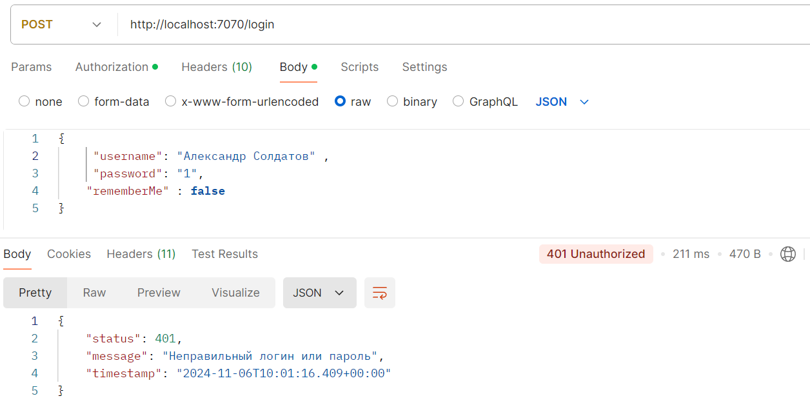
проверка логина с новым паролем
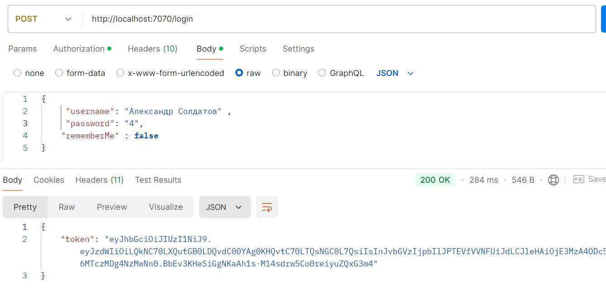
При этом старый токен будет являть невалидным из-за чего доступ к остальным эндпоинтам будет запрещен
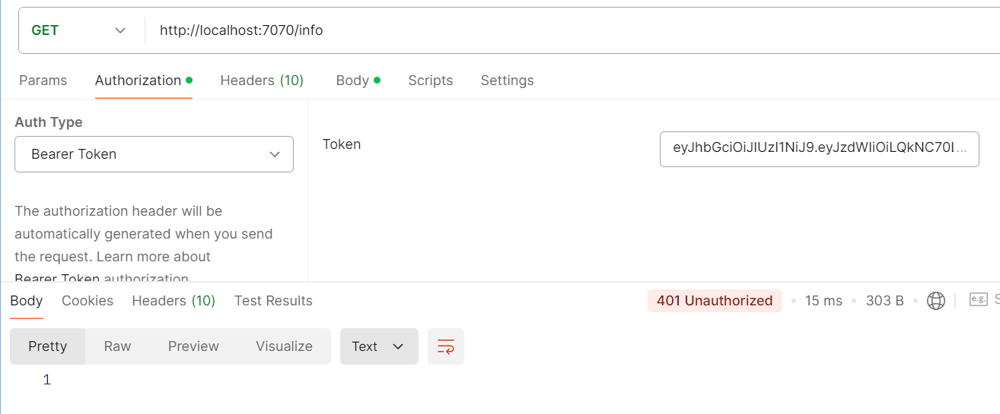